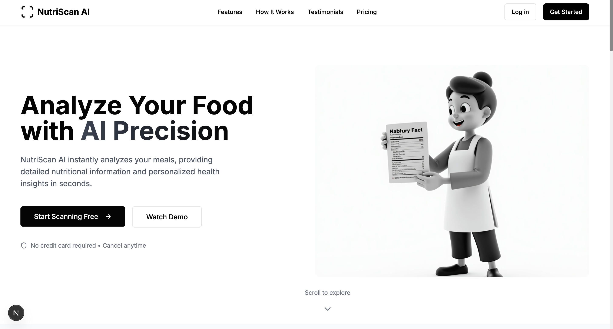
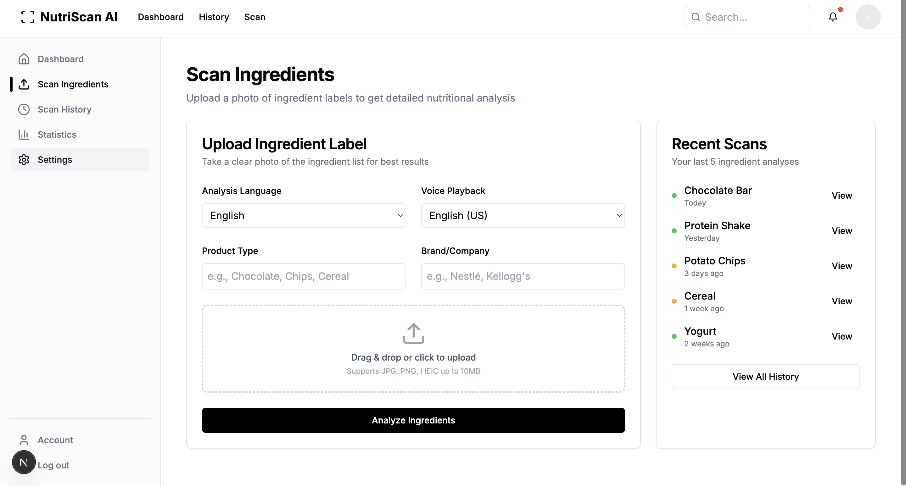

#  AI Nutrition Label Analyzer 
A smart web app that helps users understand food labels in simple language using Gemini AI — complete with health reports, friendly suggestions, and visual ingredient breakdowns.

---


  


 |


## ✨ Features

- 🔍 **Ingredient Analysis**: Upload or input ingredients and receive a clear, easy-to-understand explanation.
- 🌿 **Health Check**: Learn whether a product is healthy or not — and why.
- 🍬 **Key Ingredient Effects**: Understand what sugar, fat, protein, etc. do to your body.
- ✅ **Healthy Alternatives**: Suggests healthier products based on your input (from known brands like Saffola, Whole Truth, Aadvik, etc.).
- 📊 **Interactive Charts**: Visualize sugar, fat, protein levels with emoji-rich bar or pie charts.
- 🌍 **Multi-language Support**: Get your health report in English or Hindi.
- 💬 **Human-like Tone**: Designed to be warm, friendly, and understandable by everyone — even non-technical users.
- 🎨 **Clean UI & Cards**: Neatly formatted reports with cards for readability and visual appeal.
- ⚡ **Fast & Private**: All analysis happens via Gemini AI securely.

---

## 🛠 Tech Stack

- **Frontend**: Next.js, Tailwind CSS, Recharts / Chart.js
- **Backend**: API Route in Next.js
- **AI Integration**: Gemini 1.5 Pro (Google Generative AI API)
- **Styling**: Dark/Light Mode Support, modern card-based UI

---

## 🚀 How It Works

1. 📝 Enter or upload a food label's ingredients.
2. 🌐 Choose your preferred language (English or Hindi).
3. 🤖 Let Gemini analyze it using a smart prompt.
4. 📄 View the health report, ingredient effects, and suggestions.
5. 📊 Explore nutrient breakdown in colorful charts.

---
 <!-- ## 📸 Screenshots

  


 | -->


## 📦 Setup

```bash
git clone https://github.com/yourusername/ai-nutrition-analyzer.git
cd ai-nutrition-analyzer
npm install